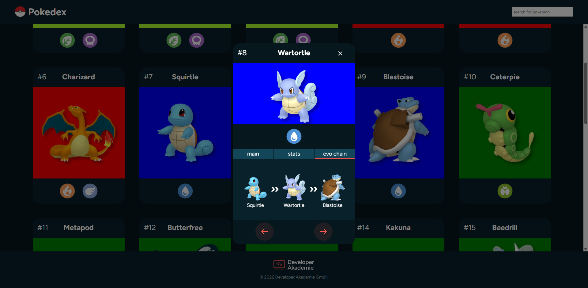

# Pokedex

A simple Pokémon library built with vanilla JavaScript. The app loads Pokémon data from the PokeAPI, lets you search for Pokémon and open a detailed dialog with stats and evolution info.

## Preview



## Quick Start

Clone the repository:

```bash
git clone https://github.com/AnnikaEgger/pokedex.git
cd pokedex
```

## Features

- Browse Pokémon cards
- Search Pokémon by name
- Load more Pokémon
- Open a detailed card with main information, stats, and evolution details

## Tech Stack

- HTML
- CSS
- JavaScript
- PokeAPI

## Project Structure

```text
.
├── assets/
│   ├── fonts/
│   ├── icons/
│   └── img/
├── scripts/
│   ├── detailed-card.js
│   └── templates.js
├── styles/
│   ├── fonts.css
│   ├── pokemon.css
│   ├── standard.css
│   └── variables.css
├── index.html
├── script.js
├── style.css
└── README.md
```
